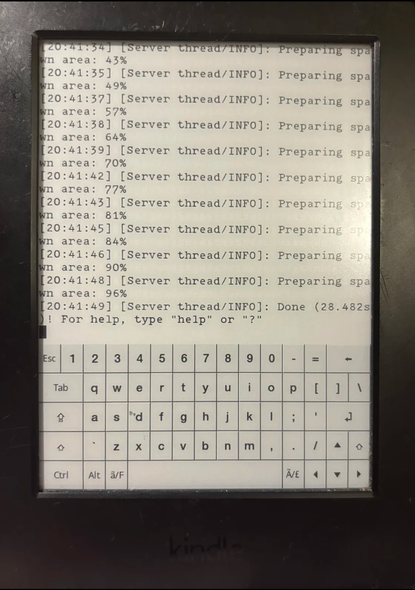

+++
date = "2026-04-28T16:17:14+01:00"
title = "KindleKraft: Minecraft on E-Ink"
description = "Running Spigot 1.7.10 on a Kindle E-Reader"
+++

The first project I ever created in this scene was known as '[KindleKraft](https://github.com/penguins184/KindleKraft)'; A Minecraft `1.7.10` server running on the infamous Amazon Kindle.

## Introduction

Prior to entering the modding scene, I was extremely invested in Minecraft server admin: From Purpur to AdvancedSlimeWorldManager, plugin development, and general server optimisation. When I discovered the power of this tiny Linux device, I *immediately* knew what I wanted to do:

... If you couldn't tell. **Run a Minecraft™ Server.**

Specifically, I was aiming to run a `1.8.x` server on the limited amount of RAM (512mb) a Kindle has, on `armel` (newer Kindles are `armhf` and have 1gb RAM, so less constraint, but I only had a `PW3` at the time).

## Issues

Right off the bat, I noticed Paper servers and any Paper-forks **would not** work on the Kindle whatsoever. I was using Azul Zulu J8, since the Kindle's bundled Java is mostly used for some legacy UI components (dubbed "Kindlets"). Regardless, I kept getting issues regarding `paperclip.jar`, and was unable to surpass them.

I shifted towards using Spigot instead, but almost immediately experienced OOM (out-of-memory) crashes. To circumvent this, I added a `256m` swapfile and killed some memory-intensive processes such as `mesquite`, `KPPMainApp`, etc. Even so, the featureset of `1.8.x` was simply too heavy for the device.

Luckily, I was able to discover a [Spigot 1.8 Nethack](https://github.com/sarabveer/CraftBukkit-Spigot-Binary/blob/master/spigot-1.7.10-1.8-R0.1/spigot-1.7.10-1.8-R0.1-1656.jar). Although the server was *technically* based on `1.7.10`, `1.8` clients were able to join, and mechanics such as the hunger bar worked perfectly!

## The Future

Today, on my Jailbroken Kindle AppStore [KindleForge](https://github.com/KindleTweaks/KindleForge), I host 'KindleCraft' (notice the different spelling); A Kindle-optimised build compiled by [Gingrspacecadet](https://github.com/Gingrspacecadet), it's a `1.21.8` [Bareiron](https://github.com/p2r3/bareiron) server, and whilst more modern and impressive, is unfortunately severely lacking in features.

In the future, if anyone reading this post manages to run a newer, featureful Minecraft server, especially on the latest/most powerful models, don't hesitate to reach out - via Guestbook, or through my Discord! :)

*- Penguins184 Out*